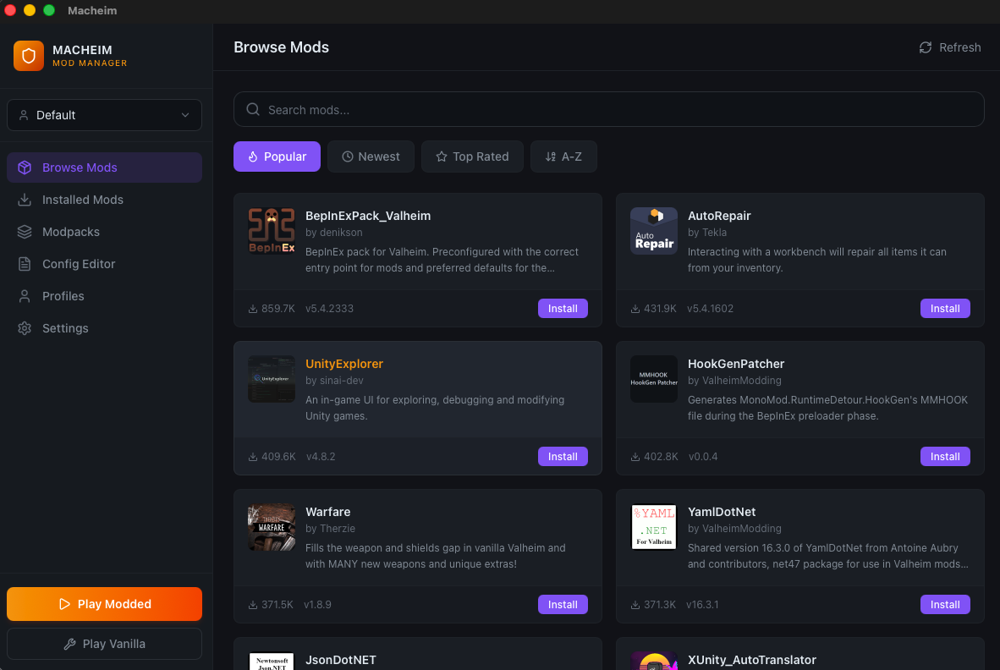
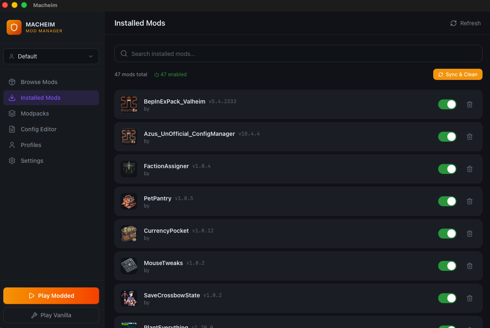
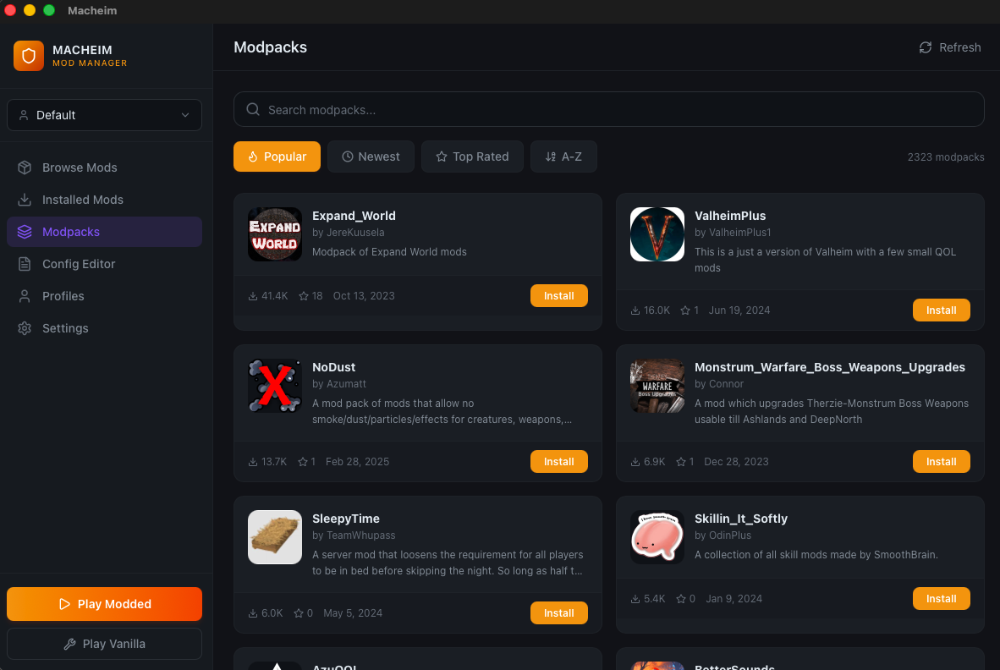

# Macheim

### Valheim Mod Manager for macOS

[](LICENSE)
[]()
[]()
[](https://tauri.app)

> [r2modman](https://github.com/ebkr/r2modmanPlus) and Thunderstore Mod Manager don't support macOS.
> **Macheim** fills that gap.

A native macOS mod manager for [Valheim](https://store.steampowered.com/app/892970/Valheim/), built with Tauri v2. Browse, install, and manage mods from [Thunderstore](https://thunderstore.io/c/valheim/) with a single click. No terminal required.

## Screenshots

| Mod Browser | Installed Mods | Modpacks |
|:---:|:---:|:---:|
|  |  |  |

## Features

- **Auto-detect Valheim** - Automatically finds your Valheim installation via Steam library
- **One-click BepInEx install** - Downloads and configures BepInEx from Thunderstore, handles macOS Gatekeeper automatically
- **Thunderstore mod browser** - Browse, search, and filter thousands of mods (Popular / Newest / Top Rated / A-Z)
- **One-click mod install** - Automatic dependency resolution using topological sort
- **Modpack support** - Install entire modpacks with all dependencies in one click
- **Profile management** - Create, switch, clone, import, and export mod profiles
- **BepInEx config editor** - Edit mod configuration files directly in the app
- **Backup & restore** - Create and restore full mod backups
- **Sync & Clean** - Re-download missing mod files and clean up orphaned files
- **Play Modded** - Launch Valheim with mods, automatically handles Rosetta for Apple Silicon
- **Dark viking-themed UI** - Built for the Valheim aesthetic
- **Lightweight** - 5.7MB DMG, 16MB app (vs Electron-based alternatives at ~1.3GB)

## Requirements

- **macOS 12+** (Monterey or later)
- **Apple Silicon** (M1/M2/M3/M4) or **Intel** Mac
- **Valheim** installed via Steam
- Internet connection for downloading mods

## Installation

### Download

1. Download `Macheim.dmg` from the [Releases](https://github.com/lofcgi/macheim/releases) page
2. Open the DMG and drag **Macheim** to your Applications folder
3. On first launch, if macOS blocks the app, go to **System Settings > Privacy & Security** and click **Open Anyway**

### Build from Source

Prerequisites: [Node.js](https://nodejs.org/) 18+, [Rust](https://rustup.rs/) 1.70+, [Tauri CLI](https://tauri.app/start/)

```bash
git clone https://github.com/lofcgi/macheim.git
cd macheim
npm install
npm run tauri build
```

The built DMG will be in `src-tauri/target/release/bundle/dmg/`.

## Getting Started

1. **Launch Macheim** - The Setup Wizard will automatically detect your Valheim installation
2. **Install BepInEx** - Click "Install BepInEx" to set up the mod framework
3. **Browse Mods** - Go to the Mods tab to browse and search Thunderstore
4. **Install** - Click any mod to see details, then click "Install" to download with all dependencies
5. **Play Modded** - Click "Play Modded" to launch Valheim with your mods enabled

## Known Issues

### Pink/Magenta Objects

Some mod-added objects (buildings, creatures, effects) may render as pink/magenta. This happens because mods ship DirectX-only shaders without Metal variants, and macOS uses Metal for rendering.

**This is a known limitation of modding Valheim on macOS.** Mod functionality is completely unaffected - only the visual appearance of some mod-added objects is impacted. Vanilla game objects are never affected.

### BepInEx Requires Rosetta

On Apple Silicon Macs, BepInEx's Harmony/MonoMod only works under x86_64 emulation. Macheim handles this automatically by launching the game via `arch -x86_64`. Rosetta will be installed automatically if not already present.

### macOS Gatekeeper

After BepInEx installation, macOS may block some libraries. Macheim automatically removes quarantine attributes, but if you encounter issues, go to **System Settings > Privacy & Security** to allow blocked items.

## Tech Stack

| Layer | Technology |
|-------|-----------|
| Framework | [Tauri v2](https://tauri.app/) |
| Backend | Rust (28 source files, 25 Tauri commands) |
| Frontend | React 19 + TypeScript + Tailwind CSS v4 |
| State | Zustand |
| UI Icons | Lucide React |

## How It Works

Macheim uses Tauri v2 to bridge a Rust backend with a React frontend:

- **Game detection**: Parses Steam's `libraryfolders.vdf` to locate Valheim
- **BepInEx management**: Downloads from Thunderstore, patches config for macOS (`Type = GameObject`), removes Gatekeeper quarantine from dylibs
- **Mod installation**: Downloads mod ZIPs, extracts to the correct profile directory, resolves dependencies via Kahn's algorithm (topological sort)
- **Game launch**: Uses `arch -x86_64 env DYLD_INSERT_LIBRARIES=libdoorstop.dylib` to bypass macOS SIP restrictions and force Rosetta on Apple Silicon

## Contributing

Contributions are welcome! Please feel free to submit a Pull Request.

1. Fork the repository
2. Create your feature branch (`git checkout -b feature/amazing-feature`)
3. Commit your changes (`git commit -m 'Add some amazing feature'`)
4. Push to the branch (`git push origin feature/amazing-feature`)
5. Open a Pull Request

## License

This project is licensed under the MIT License - see the [LICENSE](LICENSE) file for details.

## Acknowledgments

- [Tauri](https://tauri.app/) - Lightweight app framework
- [BepInEx](https://github.com/BepInEx/BepInEx) - Unity mod loader framework
- [Thunderstore](https://thunderstore.io/) - Mod repository and API
- [r2modmanPlus](https://github.com/ebkr/r2modmanPlus) - Inspiration for this project
- The Valheim modding community
